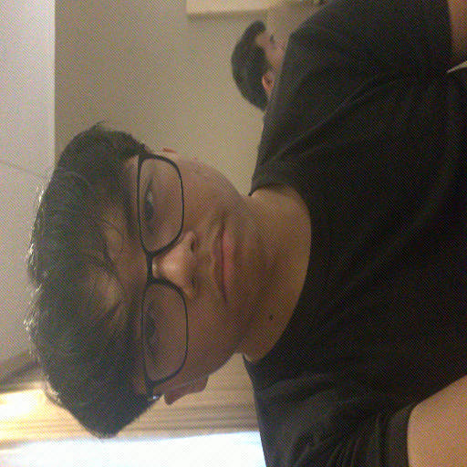
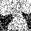

# Sistem Watermarking DCT & Evaluasi Kompresi JPEG

Proyek ini adalah implementasi dari **Digital Image Watermarking** menggunakan algoritma *Discrete Cosine Transform (DCT)*. Program akan menyisipkan sebuah gambar (watermark) ke dalam foto utama, dan menguji seberapa kuat watermark tersebut bertahan terhadap kompresi JPEG.

Berikut adalah penjelasan *step-by-step* dari awal hingga akhir proses bagaimana kode program ini bekerja:

---

## Step-by-Step Proses Algoritma

### Step 1: Persiapan (Preprocessing)
Program dimulai dengan membaca dua gambar utama yaitu wajah.png dan Watermark.jpg. Foto utama distandarkan ukurannya menjadi **512x512 piksel**. Kemudian, gambar watermark di-resize menjadi **64x64 piksel** dan dikonversi menjadi gambar biner (hitam-putih murni yang hanya berisi angka 0 dan 1).

| Foto Utama (Host) | Gambar Watermark (Biner) |
| :---: | :---: |
|  |  |

### Step 2: Konversi Warna & Pengacakan
- **Konversi Ruang Warna:** Karena kompresi JPEG beroperasi paling ekstensif pada tingkat kecerahan, foto utama diubah dari format warna RGB menjadi **YCrCb**. Watermark hanya akan disembunyikan secara eksklusif pada **Channel Y (Luminance)**.
- **Enkripsi:** Agar lebih aman dan menghindari pembentukan pola hantu (*ghosting effect*) dari wajah asli saat diekstrak nanti, susunan biner gambar watermark "diacak" secara merata menggunakan kunci *pseudo-random* (operasi matematika XOR).

### Step 3: Penyisipan Watermark (DCT Embedding)
Channel Y dari foto utama dipecah menjadi matriks kotak-kotak kecil berukuran **8x8 piksel**. Setiap kotak diubah menggunakan rumus matematika **DCT** ke dalam bentuk peta frekuensi. 

Program menyisipkan bit watermark ke dalam frekuensi menengah dari blok tersebut. Program menggunakan trik **Dynamic Alpha** (kekuatan sisipan piksel yang nilainya diacak dari 15 hingga 100) agar kerusakannya nanti menurun perlahan-lahan. Setelah disisipkan, matriks frekuensi dikembalikan menjadi piksel warna normal.

| Hasil Foto Setelah Disisipi Watermark (Aman 100%) |
| :---: |
|  |
| *Secara kasat mata, modifikasi frekuensi DCT yang kita lakukan tidak menimbulkan perubahan sedikit pun pada foto asli.* |

### Step 4: Simulasi Kompresi (JPEG Compression)
Kini foto yang sudah ber-watermark diuji ketahanannya! Program akan melakukan *looping* untuk mengompresi gambar ini secara perlahan, menurunkan kualitasnya (**Quality Factor / QF**) dari yang paling mulus (**QF 100**) hingga yang paling hancur/pecah (**QF 10**). Proses kompresi ini meniru secara persis algoritma pemotongan memori yang terjadi pada format `.jpeg` standar.

| Fase Kompresi Menengah (QF 070) | Fase Kompresi Ekstrem (QF 020) |
| :---: | :---: |
|  |  |
| *Kualitas mulai menurun, muncul JPEG samar di sekitar wajah.* | *Foto rusak parah, warna dan ketajaman hancur menjadi pixelated.* |

### Step 5: Ekstraksi & Unscramble Watermark
Dari setiap foto yang telah dirusak oleh kompresi di atas, program mencoba mengekstrak (membaca dan membongkar kembali) blok 8x8 DCT-nya untuk menemukan sisa-sisa watermark. Bit yang berhasil ditemukan kemudian **di-unscramble** (dikembalikan dari acakan XOR) untuk mengembalikan susunan gambarnya. Terakhir, program menghitung *Akurasi (%)* dari gambar yang aman.

| Watermark Selamat (Dari QF 100) | Watermark Rusak (Dari QF 070) | Watermark Hancur (Dari QF 020) |
| :---: | :---: | :---: |
|  |  |  |
| **Akurasi ~100%:** Gambar terekstrak utuh dan tajam. | **Akurasi Menurun:** Sebagian piksel telah hilang berubah menjadi *noise*. | **Akurasi Hancur:** Hanya tersisa *noise* statis akibat keberhasilan metode pengacakan. |

---

## Menjalankan Program
Untuk mengamati dan membuktikan seluruh *pipeline* algoritma di atas secara langsung, jalankan satu perintah berikut di terminal:
```bash
python kompresi.py
```
*(Program akan secara otomatis memproses kompresi, memunculkan grafik perbandingan (Akurasi Watermark vs PSNR Foto), dan mencetak puluhan rekaman uji ketahanan gambar ini di folder Output).*